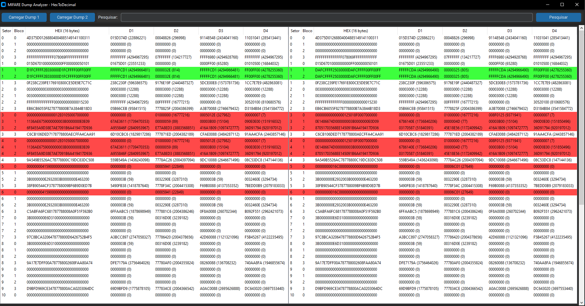

# MIFARE Dump Analyzer - HexToDecimal

## Overview / Visão Geral

### EN

**MIFARE Dump Analyzer** is a tool for decoding, analyzing, and comparing **MIFARE Classic dump files**.

It was designed for users who extract card data using hardware such as **Proxmark3**, **Chameleon Ultra**, or **Flipper Zero**, allowing analysis from multiple dump formats in a single interface.

Since MIFARE Value Blocks store numeric values using **Little Endianness (reversed byte order)**, the application automatically reorders bytes and converts them into decimal values, making balance, counters, and stored credits easy to interpret.

---

### PT-BR

O **MIFARE Dump Analyzer** é uma ferramenta para decodificação, análise e comparação de **dumps MIFARE Classic**.

Ela foi desenvolvida para usuários que extraem dados de cartões utilizando dispositivos como **Proxmark3**, **Chameleon Ultra** ou **Flipper Zero**, permitindo analisar diferentes formatos de dump em uma única interface.

Como os **Value Blocks** do MIFARE armazenam valores numéricos em **Little Endian (ordem invertida dos bytes)**, a aplicação reorganiza automaticamente os bytes e converte os valores para decimal, facilitando a leitura de saldos, contadores e créditos armazenados.

---

## Features / Funcionalidades

- Modern GUI built with **customtkinter** (Dark Mode)
- Side-by-side comparison between two dumps
- Automatic **Value Block detection** (redundancy validation)
- Automatic Little Endian → Decimal conversion
- Advanced search (HEX and Decimal values)
- Synchronized scrolling between dump views
- Universal dump loader (multi-format support)

### Color visualization

* 🔴 **Red** → Differences between Dump 1 and Dump 2
* 🟢 **Green** → Valid MIFARE Value Blocks detected
* 🟡 **Yellow** → Search matches

---

## Dump Structure / Estrutura do Dump

### EN

Each MIFARE Classic block contains **16 bytes**, which are internally divided by the analyzer into four sections:

* **D1** → Bytes 0–3
* **D2** → Bytes 4–7
* **D3** → Bytes 8–11
* **D4** → Bytes 12–15

This division helps visualize and validate **MIFARE Value Blocks** | The converted decimal value is displayed between parentheses (...)


### PT-BR

Cada bloco do MIFARE Classic possui **16 bytes**, que são divididos internamente pelo analisador em quatro partes:

* **D1** → Bytes 0–3
* **D2** → Bytes 4–7
* **D3** → Bytes 8–11
* **D4** → Bytes 12–15

Essa divisão facilita a visualização e validação dos **Value Blocks do MIFARE** | Os valores convertidos em decimal ficam entre (...)

---

## Supported Formats / Formatos Suportados

The analyzer now supports multiple industry-standard dump formats:

### ✅ `.mct` / `.txt`

Exported from:

* **Mifare Classic Tools (Android)**
* Proxmark3 conversions
* Manual sector dumps

---

### ✅ `.json`

Compatible with **Proxmark3 JSON exports**

Example structure:

```json
{
  "blocks": {
    "0": "FFFFFFFFFFFFFFFFFFFFFFFFFFFFFFFF",
    "1": "00000000000000000000000000000000"
  }
}
```

---

### ✅ `.nfc`

Compatible with **Flipper Zero NFC device dumps**

Supports:

* MIFARE Classic 1K
* Sector/block automatic reconstruction
* Unknown blocks (`??`) automatically ignored

---

## Compatibility / Compatibilidade

Compatible with dumps generated after key extraction using:

* Proxmark3
* Chameleon Ultra
* Flipper Zero
* Mifare Classic Tools (MCT)

All formats are internally normalized into a unified sector/block structure for comparison.

---

## How It Works / Como Funciona

1. Load Dump 1
2. (Optional) Load Dump 2
3. Analyzer automatically:

   * Detects Value Blocks
   * Converts values to Decimal
   * Highlights differences
   * Enables instant searching

---

## Use Cases / Casos de Uso

* MIFARE Classic reverse engineering
* Stored value analysis
* Dump comparison after transactions
* Card behavior testing
* Security research & educational analysis

---

## Requirements

```bash
pip install customtkinter
```

---

## Screenshot

<p align="center">
  
</p>

---

## License

Educational and research purposes only.
